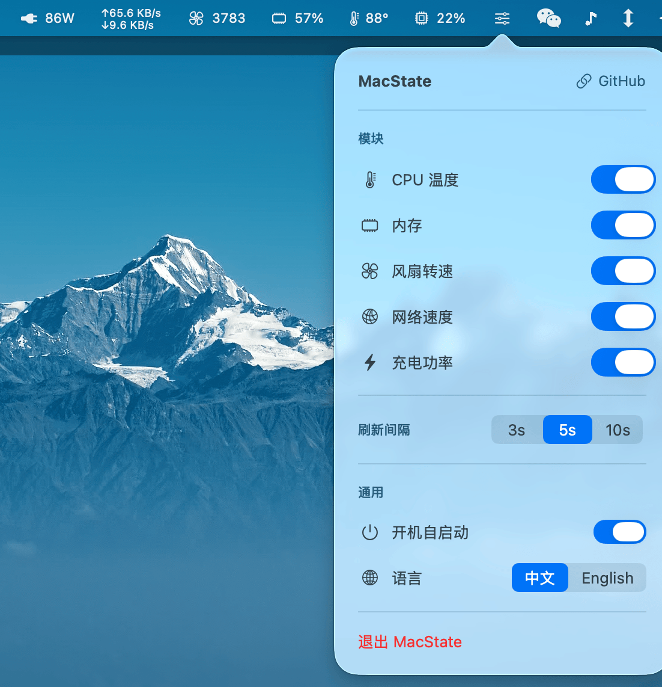
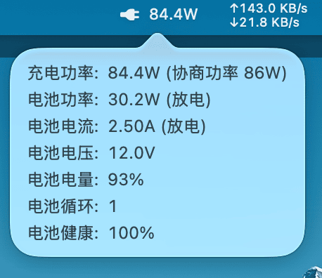

# MacState

[English](README_EN.md)

轻量级 macOS 菜单栏系统监控工具。所有指标合并显示在单个状态栏项中，资源占用极低。

  

## 截图

**状态栏**


**设置面板**



**充电信息**



## 功能

- **CPU 使用率** — 实时百分比，始终显示，点击弹出 Top 10 进程排行
- **CPU 温度** — SMC 读取，无需 root 权限
- **内存占用** — 已用/总量百分比，点击弹出 Top 10 内存进程排行
- **风扇转速** — 支持多风扇 RPM 显示
- **网络速度** — 上传/下载两行紧凑显示，自动单位换算，点击弹出 Top 10 网络进程排行
- **进程排行面板** — 支持列头排序、完整命令行查看、IP 归属地（离线数据库，0 网络依赖）
- **充电功率** — 充电器总功率实时显示，点击查看电池详情（充电器规格、电池功率、电流、电压、电量、循环次数、健康度）
- **独立设置入口** — 状态栏常驻设置图标，点击打开设置面板
- **中文/英文** — 默认中文，可切换，面板标题和内容实时跟随语言切换
- **开机自启动** — 基于 SMAppService
- **极低资源占用** — 单状态栏项合并渲染，变化检测跳过无效更新，CPU 占用接近 0%
- **可扩展架构** — 添加新模块只需实现 Service + 注册 ModuleType
- **Finder 右键菜单** — FinderSync 扩展，右键文件/文件夹/空白处：
  - "在此打开终端" — 在对应目录打开 Terminal，行为与系统原生一致
  - "复制路径" — 复制完整路径到剪贴板，多选时逐行复制
  - 设置面板可一键开关此功能

## 系统要求

- macOS 13.0+
- Intel (x86_64) 或 Apple Silicon (arm64)
- Xcode Command Line Tools

## 安装

### 下载安装

前往 [Releases](https://github.com/snail007/macstate/releases) 下载最新版本：

- **DMG** — 打开后拖拽到 Applications
- **ZIP** — 解压后移动到 Applications

### 源码编译

```bash
git clone https://github.com/snail007/macstate.git
cd macstate
bash build.sh
cp -R build/MacState.app /Applications/
open /Applications/MacState.app
```

## 使用

- 状态栏合并显示所有指标，紧凑高效
- **点击设置图标** → 打开/关闭设置面板
- **点击 CPU / 内存 / 网络指标** → 弹出 Top 10 进程排行面板
- **点击温度 / 风扇 / 电池指标** → 弹出详情提示框（点击面板外区域关闭）
- 设置面板可开关各模块、调整刷新间隔（3/5/10 秒）、切换语言、开关自启动
- 笔记本无电池时自动隐藏充电功率模块

## 项目结构

```
MacState/
├── App/
│   └── MacStateApp.swift            # 入口
├── Core/
│   ├── SMCService.swift             # SMC 读取（温度、风扇）
│   ├── CPUService.swift             # CPU 使用率
│   ├── MemoryService.swift          # 内存信息
│   ├── NetworkService.swift         # 网络速度
│   ├── BatteryService.swift         # 电池与充电功率
│   ├── ProcessCPUService.swift      # Top CPU 进程
│   ├── ProcessMemoryService.swift   # Top 内存进程
│   ├── ProcessNetworkService.swift  # Top 网络进程
│   ├── ConnectionService.swift      # 进程连接枚举（TCP/UDP）
│   ├── IP2RegionService.swift       # IP 归属地查询（离线）
│   ├── CPUProcessPanel.swift        # CPU 进程排行面板
│   ├── MemoryProcessPanel.swift     # 内存进程排行面板
│   ├── NetworkProcessPanel.swift    # 网络进程排行面板
│   ├── ClickableLabel.swift         # 可点击标签组件
│   ├── MonitorManager.swift         # 数据管理与刷新调度
│   ├── StatusBarController.swift    # 状态栏合并渲染
│   ├── Localization.swift           # 中英文国际化
│   ├── LaunchAtLoginService.swift   # 开机自启动
│   ├── FinderMenuToggle.swift       # Finder 右键菜单开关
│   └── PrivilegeService.swift       # 权限管理
├── Extensions/
│   ├── FinderMenuSync.swift         # FinderSync 扩展（右键菜单）
│   ├── FinderMenuSync.entitlements  # 扩展沙盒配置
│   ├── FinderMenuSync-Info.plist    # 扩展 Info.plist
│   └── main.swift                   # 扩展入口
├── Views/
│   ├── SettingsView.swift           # 设置面板
│   └── PopoverView.swift            # Popover 容器
├── Vendor/
│   └── ip2region/                   # ip2region C 库
├── Resources/
│   ├── ip2region_v4.xdb             # IP 归属地离线数据库
│   ├── Info.plist
│   └── MacState.entitlements
└── Assets.xcassets/
```

## 技术实现

| 指标 | 数据源 |
|---|---|
| CPU 使用率 | `host_processor_info` |
| CPU 温度 | IOKit SMC (`TC0P`) |
| 风扇转速 | IOKit SMC (`F%dAc`) |
| 内存 | `host_statistics64` |
| 网络速度 | `sysctl` `NET_RT_IFLIST2` |
| 充电功率 | IOKit `AppleSmartBattery` + SMC `PDTR` |
| 进程信息 | `libproc` (`proc_pidinfo`, `proc_pidfdinfo`) |
| IP 归属地 | ip2region 离线数据库 |
| Finder 右键菜单 | FinderSync 扩展 + DistributedNotificationCenter |

## License

[MIT](LICENSE)
