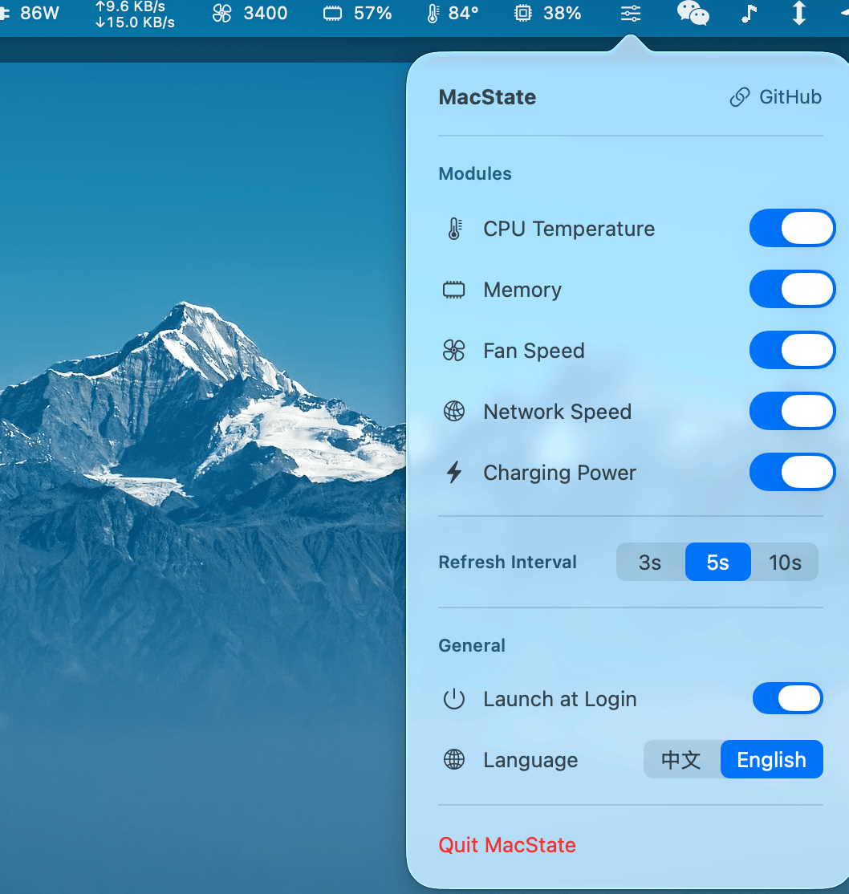
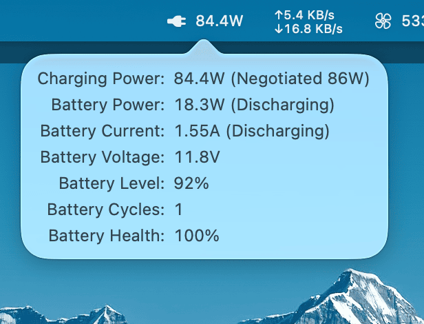

# MacState

[中文](README.md)

Lightweight macOS menu bar system monitor. All metrics are merged into a single status bar item with minimal resource usage.

  

## Screenshots

**Menu Bar**


**Settings Panel**



**Battery Details**



## Features

- **CPU Usage** — Real-time percentage, always visible, click to show Top 10 processes
- **CPU Temperature** — SMC readout, no root required
- **Memory Usage** — Used/total percentage, click to show Top 10 memory processes
- **Fan Speed** — Multi-fan RPM display
- **Network Speed** — Upload/download in compact two-line layout, auto unit scaling, click to show Top 10 network processes
- **Process Panel** — Sortable columns, full command line view, IP geolocation (offline database, zero network dependency)
- **Charging Power** — Real-time charger wattage, click for battery details (charger info, battery power, current, voltage, level, cycle count, health)
- **Dedicated Settings Entry** — Persistent settings icon in menu bar, click to open settings panel
- **Chinese/English** — Default Chinese, switchable, panel titles and content update in real-time
- **Launch at Login** — Based on SMAppService
- **Ultra-low Resource Usage** — Single status item merged rendering, change-detection skips unnecessary updates, near-zero CPU usage
- **Extensible Architecture** — Add new modules by implementing a Service and registering a ModuleType
- **Finder Context Menu** — FinderSync extension, right-click on files/folders/blank space:
  - "Open Terminal Here" — Opens Terminal in the corresponding directory, identical to native behavior
  - "Copy Path" — Copies full path to clipboard, one path per line for multiple selections
  - Toggle on/off from the settings panel

## Requirements

- macOS 13.0+
- Intel (x86_64) or Apple Silicon (arm64)
- Xcode Command Line Tools

## Installation

### Download

Go to [Releases](https://github.com/snail007/macstate/releases) to download the latest version:

- **DMG** — Open and drag to Applications
- **ZIP** — Unzip and move to Applications

### Build from Source

```bash
git clone https://github.com/snail007/macstate.git
cd macstate
bash build.sh
cp -R build/MacState.app /Applications/
open /Applications/MacState.app
```

## Usage

- All metrics are merged into a single compact status bar item
- **Click settings icon** → Opens/closes the settings panel
- **Click CPU / Memory / Network metrics** → Shows Top 10 process panel
- **Click Temperature / Fan / Battery metrics** → Shows detail tooltip (click outside to dismiss)
- Settings panel: toggle modules, adjust refresh interval (3/5/10s), switch language, toggle launch at login
- Charging power module is automatically hidden on desktops without a battery

## Project Structure

```
MacState/
├── App/
│   └── MacStateApp.swift            # Entry point
├── Core/
│   ├── SMCService.swift             # SMC access (temperature, fan)
│   ├── CPUService.swift             # CPU usage
│   ├── MemoryService.swift          # Memory info
│   ├── NetworkService.swift         # Network speed
│   ├── BatteryService.swift         # Battery & charging power
│   ├── ProcessCPUService.swift      # Top CPU processes
│   ├── ProcessMemoryService.swift   # Top memory processes
│   ├── ProcessNetworkService.swift  # Top network processes
│   ├── ConnectionService.swift      # Process connection enumeration (TCP/UDP)
│   ├── IP2RegionService.swift       # IP geolocation lookup (offline)
│   ├── CPUProcessPanel.swift        # CPU process panel
│   ├── MemoryProcessPanel.swift     # Memory process panel
│   ├── NetworkProcessPanel.swift    # Network process panel
│   ├── ClickableLabel.swift         # Clickable label component
│   ├── MonitorManager.swift         # Data management & refresh scheduling
│   ├── StatusBarController.swift    # Status bar merged rendering
│   ├── Localization.swift           # Chinese/English localization
│   ├── LaunchAtLoginService.swift   # Launch at login
│   ├── FinderMenuToggle.swift       # Finder context menu toggle
│   └── PrivilegeService.swift       # Privilege management
├── Extensions/
│   ├── FinderMenuSync.swift         # FinderSync extension (context menu)
│   ├── FinderMenuSync.entitlements  # Extension sandbox config
│   ├── FinderMenuSync-Info.plist    # Extension Info.plist
│   └── main.swift                   # Extension entry point
├── Views/
│   ├── SettingsView.swift           # Settings panel
│   └── PopoverView.swift            # Popover container
├── Vendor/
│   └── ip2region/                   # ip2region C library
├── Resources/
│   ├── ip2region_v4.xdb             # IP geolocation offline database
│   ├── Info.plist
│   └── MacState.entitlements
└── Assets.xcassets/
```

## Technical Details

| Metric | Data Source |
|---|---|
| CPU Usage | `host_processor_info` |
| CPU Temperature | IOKit SMC (`TC0P`) |
| Fan Speed | IOKit SMC (`F%dAc`) |
| Memory | `host_statistics64` |
| Network Speed | `sysctl` `NET_RT_IFLIST2` |
| Charging Power | IOKit `AppleSmartBattery` + SMC `PDTR` |
| Process Info | `libproc` (`proc_pidinfo`, `proc_pidfdinfo`) |
| IP Geolocation | ip2region offline database |
| Finder Context Menu | FinderSync extension + DistributedNotificationCenter |

## License

[MIT](LICENSE)
